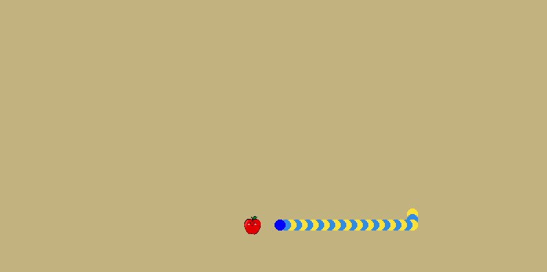

# Snake Machine Learning

## Description
This is a project to train a neural network to play the game snake. The neural network is trained using a genetic algorithm. The project is written in python and uses the arcade library for the game, Numpy and Pandas for using dataset, and Tensorflow for creating and training a MLP model.



Dataset generate by recording movement of another snake which moves automatically with rules. Dataset use for training MLP model and here is model`s loss and accuracy :


|   |Accuracy|Loss|
|---|---|---|
|Train|1.000|1.3329e-05
|Test|1.000|1.1516e-05


## How to install
* Just need to install required libraries
```
pip install -r requirement.txt
```

## Haw to run
1. First you have to run `generate_dataset.py` to generate dataset. Run the code and let it work a little, then save dataset and exit by pressing <kbd>Q</kbd> key.
2. Then we need to make a model and train it with dataset. You just have to run `train.py`.
3. Finally you can run `main_ml.py` and the project will work automatically.

* You can also run `main_ai.py` to watch another version of game which work with rules and with running `main_manual.py` you can try the game yourself and playing with
<kbd>↑</kbd> <kbd>←</kbd> <kbd>↓</kbd> <kbd>→</kbd> keys. 